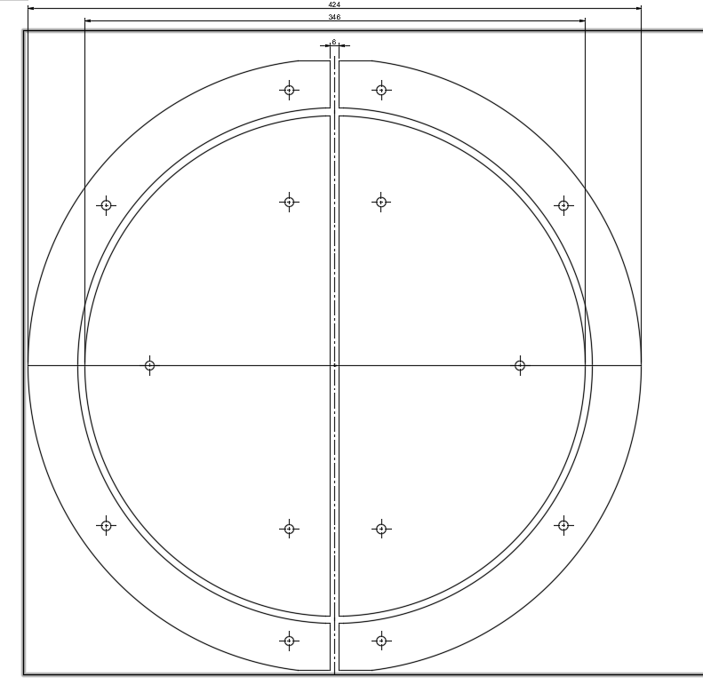
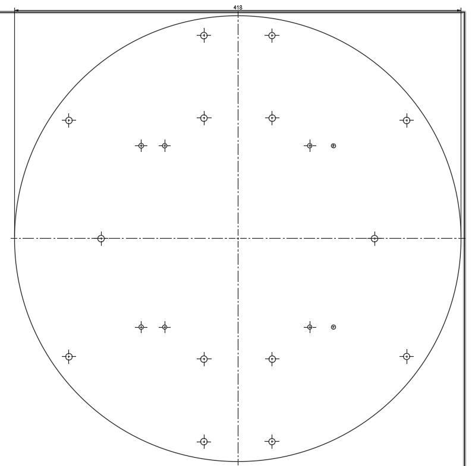
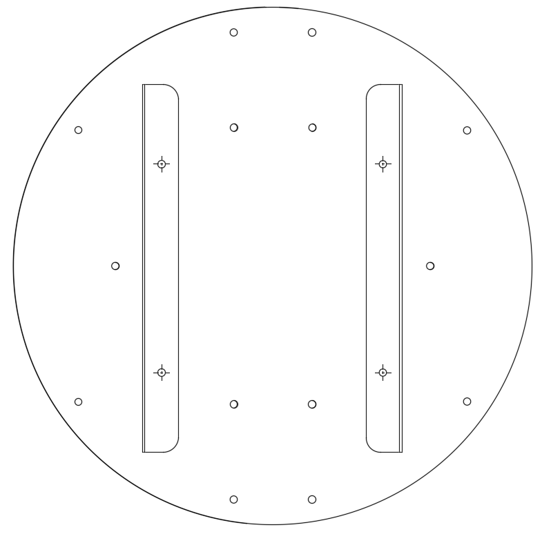

# HIDtaiko Ver.1.2
低コストで高性能なおうち太鼓を作ることを目標としています。
様々な機能を追加でき、改造もしやすく、安価で入手しやすい部品で作れるようになっているのがHIDtaikoの特徴です。

### お問合せ
https://twitter.com/kasashiki
### ビルドガイド
https://zenn.dev/kasashiki/articles/7bf286b8120f90
### youtube
https://www.youtube.com/watch?v=Z8ZBOPpMMD8

# BOM
| 部品 | 数量 | 品番 |
| ---- | ---- | ---- |
| 防振ゴム | 14 |VD2-2015M6|
| M6ネジ | 14 | M6L16 |
| M6ナット |14 | https://amzn.to/3tjdoqh |
| M6ワッシャー | 14 | https://amzn.to/3tk3ghd |
|ラワンベニヤ | 12mm | ホームセンター |  
|pro micro | 1 | https://amzn.to/3PINKD6 |
|1MΩ | 4 | https://amzn.to/3towuvm |
|圧電素子| 4 | https://amzn.to/3PJprVA |
|工作用ケーブル|1 |https://amzn.to/3Msf9Ik|
|熱収縮チューブ|1 |https://amzn.to/3snJRvB|　
|隙間スポンジテープ|1 |ダイソーの物がおすすめ|　

## License
*** by kasashiki is licensed under the Apache License, Version2.0

#自作おうち太鼓#HIDtaiko#接続器
