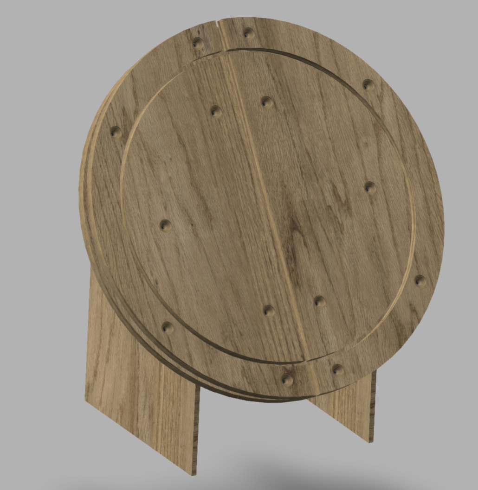
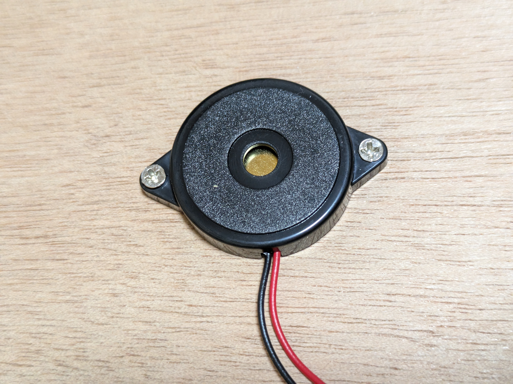

# HIDtaiko 
#### 低価格で高性能なおうち太鼓プロジェクト
#### HIDtaikoでは[基盤](drumhead/readme_drumhead.md)、[接続器](HIDtaiko_connector_rp2040/rp2040readme.md)の設計を行っています。

 
 
# ◇readme構造
<pre>
.
└── README.md(メイン)
    ├── rp2040readme.md(RP2040接続器の組み立て方、詳細)
    ├── readme_drumhead.md(基盤、詳細)

</pre>

# ◇接続器
## 各接続器の比較表
| 項目| 1.2接続器|1.3接続器|2.0接続器| [RP2040接続器](HIDtaiko_connector_rp2040/rp2040readme.md)|
|-----|---------|-------|-----------------|-----|
| 対応デバイス     | PC, Switch | PC| PC, Switch| PC |
| 感度変更方法     |Arduino IDEでスケッチを書き換え| 感度変更サイトで変更可能 | 接続器単体で変更可能 | 感度変更サイトで変更可能 |
| ファームウェア   | Arduino IDE| Arduino IDE|Arduino IDE| Pico SDK|
| 回路             | 簡易的な1MΩ抵抗| 簡易的な1MΩ抵抗| オペアンプによる信号の増幅| ショットキーバリアダイオードクランプ回路|
| 改造のしやすさ   | 簡単| 簡単| 簡単| 難しい|
| 制作難易度       | 中〜高（Arduinoの知識が必要）| 中〜高（Arduinoの知識が必要）| 中〜高（Arduinoの知識が必要）| 低（簡単なはんだ付けのみでOK|
| 制作費用         | 最低構成1500円程度| 最低構成1500円程度| 最低構成2200円程度|最安800円程度|
| 補足             | Switchで使いたい人におすすめ|-|※原因不明の無反応が発生することあり| ※最も新しく、性能も最も高いおすすめモデル   |
| プレイ動画       |[動画を見る](https://www.youtube.com/watch?v=cY1Ix29XORo)| [動画を見る](https://www.youtube.com/watch?v=Z8ZBOPpMMD8) | [動画を見る](https://www.youtube.com/watch?v=VVSo0jgkqcQ)| [動画を見る](https://www.youtube.com/watch?v=wMSDLN9h2Co)|

# ◇[基盤](drumhead/readme_drumhead.md)

## webサイトで基盤のデザインを確認できます:[基盤3Dデータ](https://a360.co/4iZLSSL)

## 基盤の制作方法→記事:[zeen](https://zenn.dev/kasashiki/articles/7bf286b8120f90) 動画:[youtube](https://www.youtube.com/watch?v=5O0MgKzX0PY)

## 特徴
| 項目 | 内容 |
|------|------|
| AC基盤との互換性 | 無 |
| 鉄板・スポンジ・樽| 使用できません |
| 対応面 | AC面・太鼓フォース面|
| 制作所要時間 | 約2〜3時間 |

# ◇センサ
## センサの比較

GSS-4SAとAT3040どちらもしっかりと固定することで弱い力でも反応します。しかし、GSS-4SAの方が性能が良いです。設定に余裕が生まれます。価格にかなり差があるため、最初はAT3040センサを購入することをお勧めします。

### [センサ組み立てガイド](drumhead/sensor.md)

| 名称 | リンク | 個数 | 合計 |
|------|--------|------|------|
| GSS-4SA（ACセンサ） | [リンク](https://www.sensatec.co.jp/products/detail.php?product_id=97) | 1個 | 700円 |
| AT3040（センサ） | [リンク](https://ja.aliexpress.com/item/1005007327162214.html?spm=a2g0o.order_list.order_list_main.17.6ab1585a40oRsJ&gatewayAdapt=glo2jpn) | 5個 | 343円 |
| ケーブル | [リンク](https://ja.aliexpress.com/item/1005005364298980.html?spm=a2g0o.order_list.order_list_main.11.1bc9585anPfqkx&gatewayAdapt=glo2jpn) | 1セット | 390円 |
|固定用M2ネジ|[amazon](https://www.amazon.co.jp/dp/B00AXVBDSO?ref_=ppx_hzsearch_conn_dt_b_fed_asin_title_3)|8本|700円|

# 質問はXのDMにお願いします。
[lit.link](https://lit.link/kasashiki)

## License
*** by kasashiki is licensed under the Apache License, Version2.0
