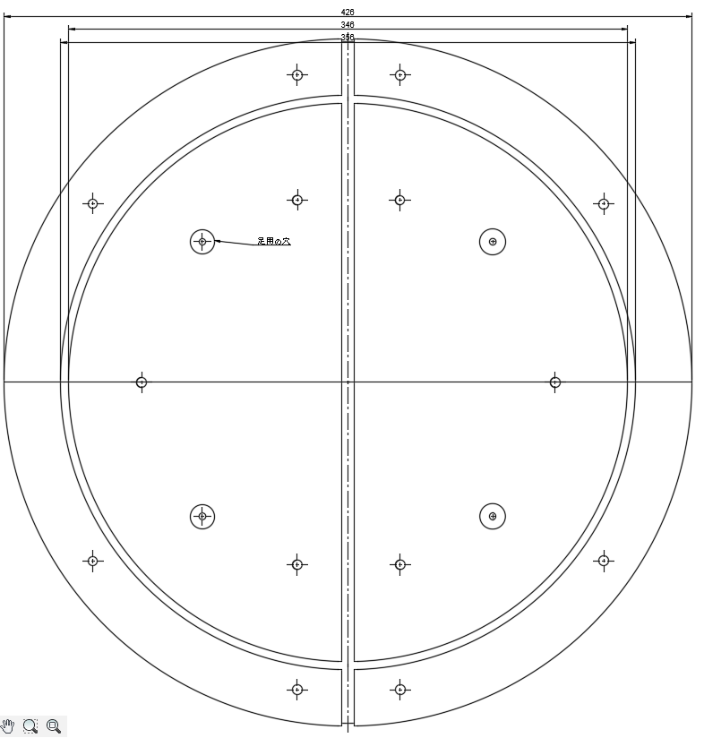

# HIDtaiko Ver.1
低コストで高性能なおうち太鼓を作ることを目標としています。

a0=左ふち a1=左ドン a2=右ドン a3が右ふち

質問やお問い合わせ
https://twitter.com/kasashiki
ビルドガイド
https://zenn.dev/kasashiki/articles/7bf286b8120f90

| 部品 | 数量 | 品番 |
| ---- | ---- | ---- |
| 防振ゴム | 14 |VD2-2015M6|
| M6ネジ | 14 | M6L16 |
| M6ナット |14 | https://amzn.to/3tjdoqh |
| M6ワッシャー | 14 | https://amzn.to/3tk3ghd |
|ラワンベニヤ | 12mm | ホームセンター |  
|pro micro | 1 | https://amzn.to/3PINKD6 |
|1MΩ | 4 | https://amzn.to/3towuvm |
|圧電素子| 4 | https://amzn.to/3PJprVA |

# ライセンス
MIT

