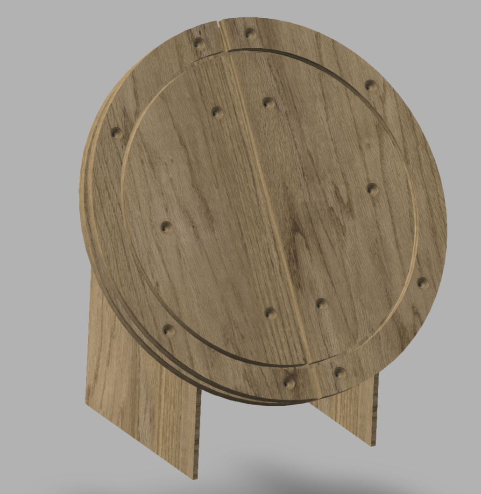
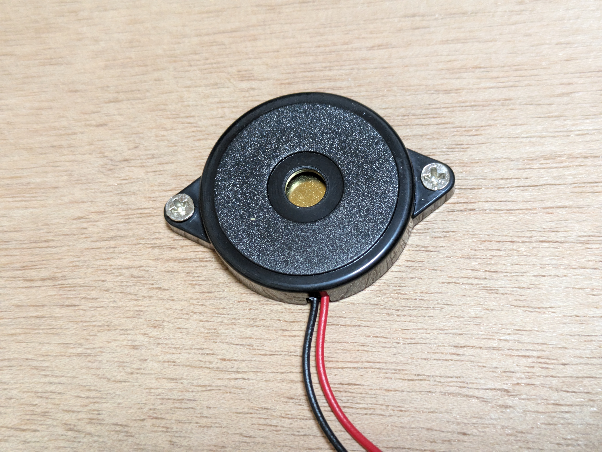

# HIDtaiko
#### A low-cost, high-performance home taiko drum project
#### HIDtaiko covers the design of the [drum head PCB](drumhead/readme_drumhead.md) and [connector](HIDtaiko_connector_rp2040/rp2040readme.md).

[日本語版 README](README.md)


# ◇ README structure
<pre>
.
└── README_EN.md (main, English)
    ├── rp2040readme.md (RP2040 connector — assembly & details)
    ├── readme_drumhead.md (drum head PCB — details)
</pre>

# ◇ Connector

## Comparison table

| | V1.2 | V1.3 | V2.0 | [RP2040](HIDtaiko_connector_rp2040/rp2040readme.md) |
|---|---|---|---|---|
| Supported devices | PC, Switch | PC | PC, Switch | PC |
| Sensitivity tuning | Sensitivity tuner site | Sensitivity tuner site | On-device | Sensitivity tuner site |
| Firmware | Arduino IDE | Arduino IDE | Arduino IDE | Pico SDK |
| Circuit | Simple 1 MΩ resistor | Simple 1 MΩ resistor | Op-amp signal amplification | Schottky diode clamp circuit |
| Modifiability | Easy | Easy | Easy | Difficult |
| Build difficulty | Medium–High (Arduino knowledge required) | Medium–High (Arduino knowledge required) | Medium–High (Arduino knowledge required) | Low (basic soldering only) |
| Cost | ~¥1,500 min | ~¥1,500 min | ~¥2,200 min | ~¥800 min |
| Notes | Recommended for Switch play | — | ※ Occasional unresponsive inputs reported | ※ Newest model, highest performance — recommended |
| Gameplay video | [Watch](https://www.youtube.com/watch?v=cY1Ix29XORo) | [Watch](https://www.youtube.com/watch?v=Z8ZBOPpMMD8) | [Watch](https://www.youtube.com/watch?v=VVSo0jgkqcQ) | [Watch](https://www.youtube.com/watch?v=wMSDLN9h2Co) |

# ◇ Sensitivity Tuner

**[→ Open Sensitivity Tuner](https://kasasiki3.github.io/HIDtaiko/)** (Chrome / Edge only)

Adjust sensitivity and delay from your browser while the connector is plugged in. Supports V1.1 (RP2040) and V1.2.

## How it works

```
Piezo → ADC (analog read) → Delta detection → Threshold check → Key input
```

When the piezo vibrates, its voltage changes. The microcontroller calculates the delta (difference from the previous sample) and fires a key input when the delta exceeds the configured threshold (sensitivity).

Timers (Delay) suppress phantom inputs — for a set duration after an input, hits from the same sensor or adjacent sensors are ignored.

| Parameter | Role |
|---|---|
| Sensitivity | Input fires when delta exceeds this value. Higher value = lower sensitivity |
| Adelay | Cooldown before the same sensor can fire again |
| Bdelay | Shared cooldown between Don (center) sensors |
| Cdelay | Shared cooldown between Rim (edge) sensors |
| Ddelay | Time to suppress Rim after a Don hit, and vice versa |

# ◇ [Drum Head PCB](drumhead/readme_drumhead.md)



## Check the PCB design in 3D: [3D model](https://a360.co/4iZLSSL)

## Build guide → Article: [Zenn](https://zenn.dev/kasashiki/articles/7bf286b8120f90) &nbsp; Video: [YouTube](https://www.youtube.com/watch?v=5O0MgKzX0PY)

## Specs

| Item | Details |
|---|---|
| AC cabinet compatibility | None |
| Steel plate / sponge / barrel | Not supported |
| Compatible surfaces | AC surface, Taiko Force surface |
| Build time | ~2–3 hours |

# ◇ Sensor

## Sensor comparison



Both the GSS-4SA and AT3040 respond to light hits when properly mounted. The GSS-4SA offers better performance and more tuning headroom. Given the significant price difference, the AT3040 is recommended for first-time builders.

### [Sensor assembly guide](drumhead/sensor.md)

| Name | Link | Qty | Total |
|---|---|---|---|
| GSS-4SA (AC sensor) | [Link](https://www.sensatec.co.jp/products/detail.php?product_id=97) | 1 | ¥700 |
| AT3040 (sensor) | [Link](https://ja.aliexpress.com/item/1005007327162214.html?spm=a2g0o.order_list.order_list_main.17.6ab1585a40oRsJ&gatewayAdapt=glo2jpn) | 5 | ¥343 |
| Cable | [Link](https://ja.aliexpress.com/item/1005005364298980.html?spm=a2g0o.order_list.order_list_main.11.1bc9585anPfqkx&gatewayAdapt=glo2jpn) | 1 set | ¥390 |
| M2 mounting screws | [Amazon](https://www.amazon.co.jp/dp/B00AXVBDSO?ref_=ppx_hzsearch_conn_dt_b_fed_asin_title_3) | 8 | ¥700 |

# Questions? DM on X.
[lit.link](https://lit.link/kasashiki)

## License
*** by kasashiki is licensed under the Apache License, Version 2.0
